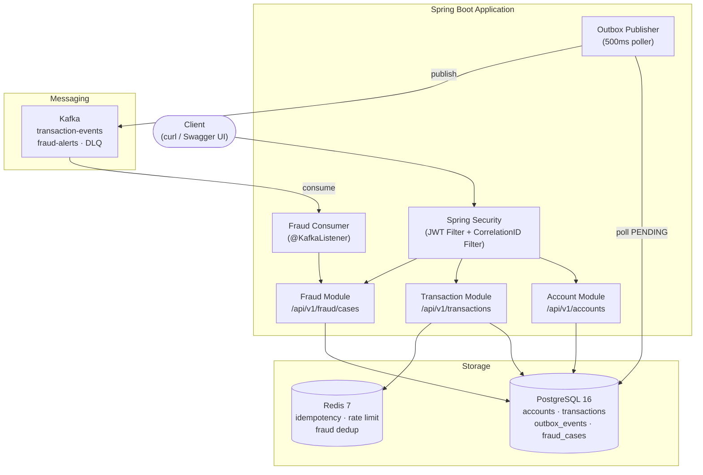

# FinFlow — Payment Processing & Fraud Detection System

Event-driven payment processing and fraud detection backend built with Java 21, Spring Boot, PostgreSQL, Redis, and Apache Kafka.

---

## Architecture

Modular Monolith with Hexagonal Architecture. Modules communicate exclusively via Kafka events — no direct cross-module method calls. The Outbox Pattern guarantees reliable event delivery even when Kafka is temporarily unavailable.



Full diagrams (sequence, state machine): [`docs/architecture/system-design.md`](docs/architecture/system-design.md)

---

## Tech Stack

| Category | Technology |
|---|---|
| Language | Java 21 (Records, Sealed Classes) |
| Framework | Spring Boot 4.x |
| Database | PostgreSQL 16 + Flyway migrations |
| Cache | Redis 7 |
| Messaging | Apache Kafka (Confluent) |
| Security | Spring Security + JWT (jjwt 0.12) |
| Resilience | Resilience4j (Retry, Circuit Breaker, Rate Limiter) |
| Metrics | Micrometer + Prometheus |
| API Docs | SpringDoc OpenAPI 3 / Swagger UI |
| Testing | JUnit 5, Mockito, Testcontainers |
| CI | GitHub Actions |
| Containerization | Docker (multi-stage build) |

---

## Features

- **Account management** — create accounts, deposit funds, check balance
- **Account-to-account transfers** — atomic DB transactions with optimistic locking
- **Transaction state machine** — `PENDING → COMPLETED / FAILED → REVERSED`, `COMPLETED → FLAGGED`
- **Idempotency** — duplicate requests return the original result (Redis, 24h TTL)
- **Rate limiting** — 10 transfers per account per minute (Redis)
- **JWT authentication** — stateless Bearer token, 24h expiry
- **Outbox Pattern** — event publishing survives Kafka outages
- **Fraud detection** — rule-based engine (HIGH_AMOUNT > 50,000); fraud cases persisted and queryable
- **Dead Letter Queue** — failed Kafka messages after 3 retries land in `transaction-events-dlq`
- **Compensating transactions** — `FAILED → REVERSED` refunds source account
- **Prometheus metrics** — `finflow.transactions.total`, `finflow.transactions.transfer.duration`, `finflow.transactions.fraud.detected`
- **Structured JSON logging** — Logstash encoder in dev profile, correlation ID on every log line

---

## Quick Start

**Prerequisites:** Java 21, Docker

```bash
# 1. Clone
git clone <repo-url> && cd finflow

# 2. Start infrastructure (PostgreSQL + Redis + Kafka)
make docker-up

# 3. Run application
make run

# 4. Open Swagger UI
open http://localhost:8080/api/v1/swagger-ui/index.html
```

**Get a token:**
```bash
curl -s -X POST http://localhost:8080/api/v1/auth/login \
  -H "Content-Type: application/json" \
  -d '{"username":"admin","password":"admin123"}' | jq .token
```

---

## API Endpoints

### Accounts
| Method | Path | Description |
|---|---|---|
| `POST` | `/api/v1/accounts` | Create account (public) |
| `GET` | `/api/v1/accounts/{id}` | Get account details |
| `POST` | `/api/v1/accounts/{id}/deposit` | Deposit funds |
| `GET` | `/api/v1/accounts/{id}/balance` | Get balance |

### Transactions
| Method | Path | Description |
|---|---|---|
| `POST` | `/api/v1/transactions` | Create transfer |
| `GET` | `/api/v1/transactions/{id}` | Get transaction |
| `POST` | `/api/v1/transactions/{id}/reverse` | Reverse failed transaction |
| `GET` | `/api/v1/transactions/account/{accountId}` | List account transactions |

### Fraud Cases
| Method | Path | Description |
|---|---|---|
| `GET` | `/api/v1/fraud/cases` | List all fraud cases |
| `GET` | `/api/v1/fraud/cases/{id}` | Get fraud case |
| `GET` | `/api/v1/fraud/cases/status/{status}` | Filter by status |
| `GET` | `/api/v1/fraud/cases/account/{accountId}` | Cases by account |
| `POST` | `/api/v1/fraud/cases/{id}/resolve` | Resolve fraud case |
| `POST` | `/api/v1/fraud/cases/{id}/dismiss` | Dismiss as false positive |

### Observability
| Method | Path | Description |
|---|---|---|
| `GET` | `/api/v1/actuator/health` | Health check |
| `GET` | `/api/v1/actuator/prometheus` | Prometheus metrics scrape |

---

## Architecture Decision Records

| ADR | Decision |
|---|---|
| [ADR-001](docs/adr/ADR-001-modular-monolith.md) | Modular Monolith over Microservices |
| [ADR-002](docs/adr/ADR-002-kafka-over-rabbitmq.md) | Kafka over RabbitMQ / SQS |
| [ADR-003](docs/adr/ADR-003-outbox-pattern.md) | Outbox Pattern for event publishing |
| [ADR-004](docs/adr/ADR-004-redis-for-idempotency.md) | Redis for idempotency and rate limiting |
| [ADR-005](docs/adr/ADR-005-jwt-authentication.md) | JWT stateless authentication |
| [ADR-006](docs/adr/ADR-006-hexagonal-architecture.md) | Hexagonal Architecture (Ports & Adapters) |

---

## Project Structure

```
src/main/java/com/finflow/
├── shared/
│   ├── config/          # KafkaConfig, OpenApiConfig, CorrelationIdFilter, ...
│   ├── security/        # SecurityConfig, JwtService, JwtAuthenticationFilter
│   ├── exception/       # GlobalExceptionHandler, custom exceptions
│   └── util/            # IdempotencyService, RateLimiterService
├── transaction/
│   ├── domain/          # Account, Transaction, TransactionEvent, OutboxEvent
│   ├── application/     # AccountService, TransactionService, OutboxService, TransactionMetrics
│   ├── infrastructure/  # AccountRepository, TransactionRepository, OutboxPublisher
│   └── api/             # AccountController, TransactionController, DTOs, mappers
└── fraud/
    ├── domain/          # FraudCase, FraudRule, FraudCaseStatus, TransactionEventPayload
    ├── application/     # FraudAnalysisService, FraudQueryService
    ├── infrastructure/  # FraudCaseRepository, FraudRuleRepository, TransactionEventConsumer
    └── api/             # FraudController, FraudCaseResponse, FraudCaseMapper

src/main/resources/
├── application.yml              # Base config
├── application-dev.yml          # Local development
├── application-docker.yml       # Docker networking overrides
├── logback-spring.xml           # JSON logging (dev) / plain text (other)
└── db/migration/                # Flyway SQL migrations (V001__..., V002__...)

infra/docker/
├── Dockerfile                   # Multi-stage build (JDK build → JRE run)
└── docker-compose.yml           # PostgreSQL + Redis + Kafka + app

docs/
├── adr/                         # Architecture Decision Records
└── architecture/                # system-design.md, failure-scenarios.md
```

---

## Testing

```bash
make test          # Run all tests + JaCoCo coverage report
make coverage      # Open report at target/site/jacoco/index.html

# Single test class
./mvnw test -Dtest=TransactionServiceTest

# Single test method
./mvnw test -Dtest=TransactionServiceTest#shouldProcessPayment
```

Coverage target: **80%** minimum. Test pyramid: unit (Mockito) → integration (Testcontainers).

---

## License

MIT
