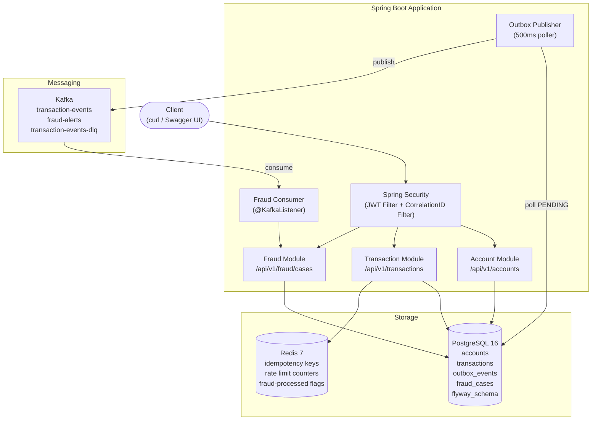
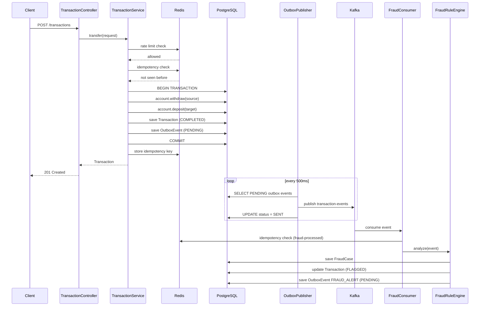
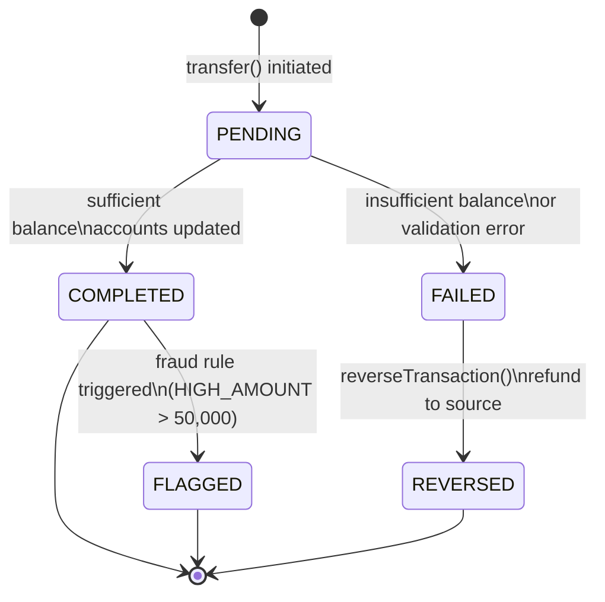

# FinFlow — System Design

## 1. Genel Mimari

```mermaid
flowchart TB
    Client(["Client\n(curl / Swagger UI)"])

    subgraph SpringBoot["Spring Boot Application"]
        Security["Spring Security\n(JWT Filter + CorrelationID Filter)"]
        AccountAPI["Account Module\n/api/v1/accounts"]
        TransactionAPI["Transaction Module\n/api/v1/transactions"]
        FraudAPI["Fraud Module\n/api/v1/fraud/cases"]
        OutboxPublisher["Outbox Publisher\n(500ms poller)"]
        FraudConsumer["Fraud Consumer\n(@KafkaListener)"]
    end

    subgraph Storage["Storage"]
        PG[("PostgreSQL 16\naccounts\ntransactions\noutbox_events\nfraud_cases\nflyway_schema")]
        Redis[("Redis 7\nidempotency keys\nrate limit counters\nfraud-processed flags")]
    end

    subgraph Messaging["Messaging"]
        KafkaTopic["Kafka\ntransaction-events\nfraud-alerts\ntransaction-events-dlq"]
    end

    Client --> Security
    Security --> AccountAPI
    Security --> TransactionAPI
    Security --> FraudAPI

    AccountAPI --> PG
    TransactionAPI --> PG
    TransactionAPI --> Redis
    FraudAPI --> PG

    OutboxPublisher -- "poll PENDING" --> PG
    OutboxPublisher -- "publish" --> KafkaTopic

    KafkaTopic -- "consume" --> FraudConsumer
    FraudConsumer --> FraudAPI
```

---

## 2. Transfer Akış Diyagramı

```mermaid
sequenceDiagram
    participant C as Client
    participant CTR as TransactionController
    participant SVC as TransactionService
    participant Redis
    participant DB as PostgreSQL
    participant OP as OutboxPublisher
    participant Kafka
    participant FC as FraudConsumer
    participant FE as FraudRuleEngine

    C->>CTR: POST /transactions
    CTR->>SVC: transfer(request)

    SVC->>Redis: rate limit check
    Redis-->>SVC: allowed

    SVC->>Redis: idempotency check
    Redis-->>SVC: not seen before

    SVC->>DB: BEGIN TRANSACTION
    SVC->>DB: account.withdraw(source)
    SVC->>DB: account.deposit(target)
    SVC->>DB: save Transaction (COMPLETED)
    SVC->>DB: save OutboxEvent (PENDING)
    SVC->>DB: COMMIT

    SVC->>Redis: store idempotency key
    SVC-->>CTR: Transaction
    CTR-->>C: 201 Created

    loop every 500ms
        OP->>DB: SELECT PENDING outbox events
        OP->>Kafka: publish transaction-events
        OP->>DB: UPDATE status = SENT
    end

    Kafka->>FC: consume event
    FC->>Redis: idempotency check (fraud-processed)
    FC->>FE: analyze(event)
    FE->>DB: save FraudCase
    FE->>DB: update Transaction (FLAGGED)
    FE->>DB: save OutboxEvent FRAUD_ALERT (PENDING)
```

---

## 3. Transaction State Machine

```mermaid
stateDiagram-v2
    [*] --> PENDING : transfer() initiated

    PENDING --> COMPLETED : sufficient balance\naccounts updated
    PENDING --> FAILED : insufficient balance\nor validation error

    FAILED --> REVERSED : reverseTransaction()\nrefund to source

    COMPLETED --> FLAGGED : fraud rule triggered\n(HIGH_AMOUNT > 50,000)

    COMPLETED --> [*]
    FLAGGED --> [*]
    REVERSED --> [*]
```
